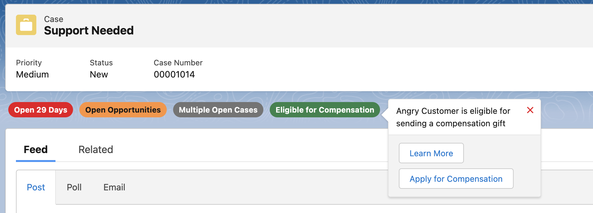
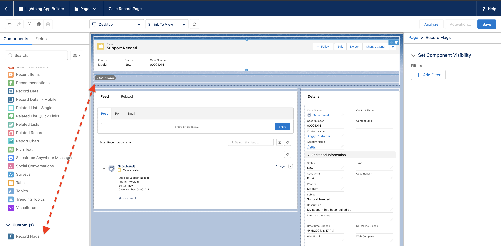
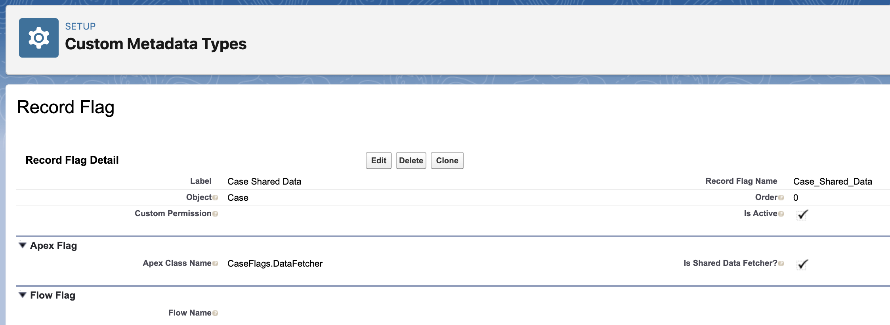
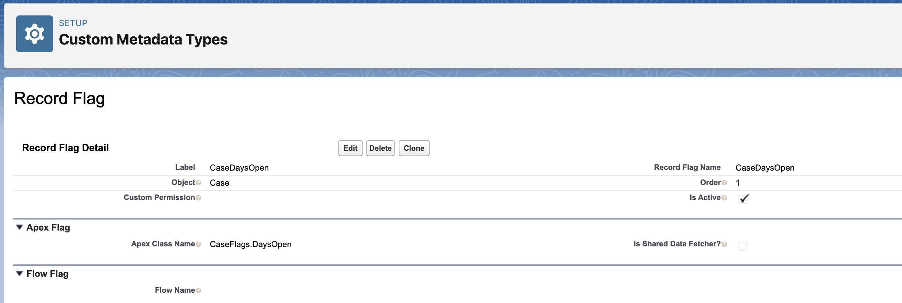
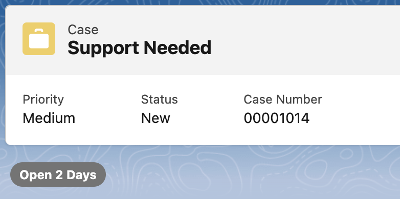
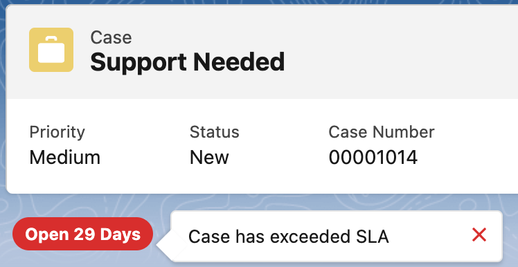
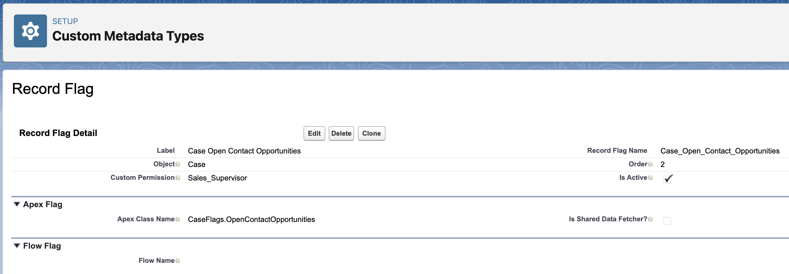
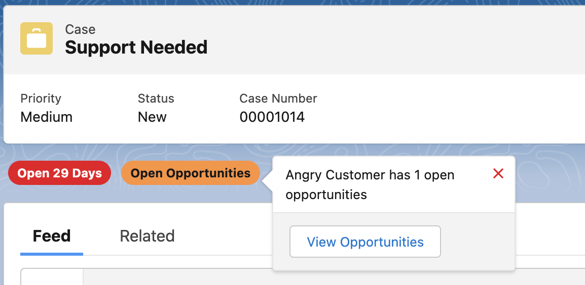
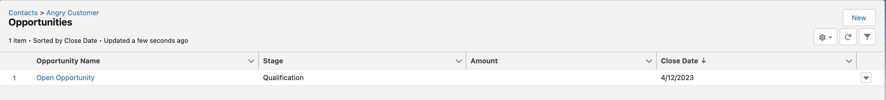

# Record Flags

The Record Flags framework allows for developers to easily surface important information about records without writing any UI code! All of the logic for calculating and rendering these flags can be achieved using Apex code or Flows!



## Installation

TODO: Add install links after approval for OSS launch.

## Setup

Enabling `Record Flags` is as simple as dragging the LWC into the Lightning Record
Page you want to enable it for! The LWC will scan for `Record Flag` custom metadata records linked to the respective object to determine which flags to render, which can be built with either Apex or Flow. Let's dive into some examples of each!



## Quick Start Example (Apex)

The first flag we'll create informs users how many days a Case has been open.
Furthermore, if the Case has been open for more than 3 weeks, it will change color and include a special
message to warn the user that the Case has violated its SLA.

To start, we need to define the Apex classes that fetch the Case data and
calculate the logic for populating the flag. We'll define a parent `CaseFlags`
class to hold both of these classes in one place for this example.

```java
public with sharing class CaseFlags {

  public class DataFetcher extends RecordFlags.SharedData {
    public void fetchData(Id caseId) {
      return [
        SELECT ClosedDate, CreatedDate
        FROM Case
        WHERE Id = :caseId
      ];
    }
  }

  public class DaysOpen extends RecordFlags.Fetcher {
    public override RecordFlag[] getFlags(SObject sharedData) {
      Case record = (Case) sharedData;
      Date comparisonDate = record.ClosedDate != null
        ? Date.valueOf(record.ClosedDate)
        : Date.today();
      Integer daysOpen = Date.valueOf(record.CreatedDate)
        .daysBetween(comparisonDate);
      return listOf(new RecordFlag(
        // Flag Type - affects the color of the pill.
        daysOpen > 21
          ? RecordFlags.FlagVariant.ERROR
          : RecordFlags.FlagVariant.NORMAL,
        // Pill Text.
        String.format('Open {0} Days', new List<Object>{ daysOpen }),
        // Message when pill is moused over.
        daysOpen > 21 ? 'Case has exceeded SLA' : null,
      ));
    }
  }
}
```

In order to link these Apex classes to the Case object, we need to create corresponding `Record Flag` metadata records to configure each Apex class. In the Setup menu navigate to `Custom Code -> Custom Metadata Types`, then click `Manage Records` for the `Record Flag` row, then click `New`:





Now, we can navigate to a specific Case record to see the flag in action! Notice the change in behavior depending on
how long the case has been open; when it has exceeded the SLA, the flag changes
color and when the user hovers over it, a message will be displayed!





### Shared Data, Buttons, & Custom Permissions

We'll add another flag that is only accessible to Sales Supervisors. It will be
displayed when the Contact of the Case has open opportunities and will provide a
button for the agent to quickly navigate to the open opportunities page.

First, we'll update the `DataFetcher` to add the extra data we need, then we'll
implement another flag. By using Shared Data, Record Flags will run faster by requiring fewer SOQL calls.

```java
public with sharing class CaseFlags {
  public class DataFetcher extends RecordFlags.SharedData {
    public void fetchData(Id caseId) {
      return [
        SELECT ClosedDate, CreatedDate, Contact.Name
        FROM Case
        WHERE Id = :caseId
      ];
    }
  }
}
```

Next, we'll add a third subclass to `CaseFlags` implementing our new logic:
```java
public with sharing class CaseFlags {
  // Other two classes are above...

  public class OpenContactOpportunities extends RecordFlags.Fetcher {
    public override RecordFlag[] getFlags(SObject sharedData) {
      Case record = (Case) sharedData;
      List<Opportunity> contactOpportunities = [
        SELECT Name
        FROM Opportunity
        WHERE ContactId = :record.ContactId AND IsClosed = FALSE
      ];
      return contactOpportunities.isEmpty()
        ? null
        : new RecordFlags.Flag(
            // Flag Type - affects the color of the pill.
            RecordFlags.FlagVariant.WARNING,
            // Pill text.
            'Open Opportunities',
            // Message when pill is moused over.
            String.format(
              '{0} has {1} open opportunities',
              new List<Object>{
                record.Contact.Name,
                contactOpportunities.size()
              }
            ),
            // Buttons on mouse over.
            new List<RecordFlags.FlagButton>{
              new RecordFlags.FlagButton(
                // Button Text.
                'View Opportunities',
                // Button link -- in this case, it's a relative URL.
                String.format(
                  '/lightning/r/Contact/{0}/related/Opportunities/view',
                  new List<Object>{ record.Contact.Id }
                )
              )
            }
          );
    }
  }
}
```

This time, we'll include a custom permission in the metadata configuration. Only
users with this custom permission will see this flag. In fact, the Apex class
will not even be invoked unless the user has the underlying custom permission.



The new flag includes the button we defined! And it works as expected when clicked on!





## Full Technical Specs

### Apex Classes

There are two types of Apex classes to extend when creating Flags for an object:

1.  One `SharedData` class per Object, responsible for performing a SOQL query to
    collect the shared data used across different flags. This can be helpful to reduce the overall number of SOQL queries necessary to calculate all flags, speeding up the overall render time. However, this is optional. Each `Fetcher` class runs in its own Apex transaction, which will help prevent running into limit errors. If no `SharedData` class is created, an empty SObject record with just the `Id` will be passed to `Fetcher` instances.

```java
public abstract class RecordFlags.SharedData {
  public abstract SObject getRecord(Id recordId);
}
```

2.  Any number of `Fetcher` classes. Each class is responsible for
    calculating the logic for a set of flags. If the class returns `null`, no
    flag will not be rendered.

```java
public abstract class RecordFlags.Fetcher {
  public abstract RecordFlag[] getFlags(SObject sharedData);
}

// Constructor for RecordFlag
public RecordFlag(
  // Affects the color of the pill.
  RecordFlag.FlagVariant variant,
  // Pill text.
  String header,
  // Message when pill is moused over.
  String body,
  // Buttons on mouse over.
  RecordFlagButton[] buttons
)

public enum RecordFlag.FlagVariant {
  // Grey
  NORMAL,
  // Green
  SUCCESS,
  // Orange
  WARNING,
  // Red
  ERROR
}

// Constructor for FlagButton
public RecordFlagButton(
  // Button text.
  String name,
  // Button hyperlink - supports relative and absolute URLs.
  String url
)
```

### Custom Metadata

In order for the `recordFlags` LWC to invoke these Apex classes from an object's
record page, they need to be defined through `Record_Flag__mdt` records:

| Field                | Usage                                                 |
| -------------------- | ----------------------------------------------------- |
| Apex_Class_Name__c   | The name of the Apex class implementing the logic.    |
| Custom_Permission__c | Optional DeveloperName of a Custom Permission. If specified, only users that have this custom permission will invoke this Apex class.                            |
| Flow_Class_Name__c   | The name of the Flow implementing the logic.          |
| Is_Active__c         | Checkbox to indicate if this Apex class should be invoked. Helpful for environment management or to quickly turn off a flag.                                      |
| Is_Data_Fetcher__c   | Checkbox to indicate if this Apex class `extends SharedData`. If set to false, it's implied the class `extends Fetcher`.                                      |
| Object__c            | The API Name of the Salesforce object.                |
| Order__c             | Order in which this Apex class should be invoked in  comparison to all other `Record_Flag__mdt` records for this Object. Runs in ascending order.           |

### LWC

The package exposes a single `recordFlags` component targeted for
`lightning__RecordPage` only. The LWC relies on both `@api recordId` and `@api
objectApiName` in order to properly invoke the interfaced Apex classes. Once the
custom metadata records are set up, simply dropping in the LWC into a properly
configured object's lightning record page will activate Record Flags. The LWC
will automatically pull in the proper metadata definitions and invoke the Apex
classes to calculate which flags to render.

Internally, this LWC relies on child `recordFlagFetcher` component that handle the calls to render each fetcher in its own transaction to avoid system limits. This can be helpful when there are multiple flags that are making slow, expensive computations (such as callouts to other systems).

## Notes

This is not an officially supported Google product. This project is not
eligible for the [Google Open Source Software Vulnerability Rewards
Program](https://bughunters.google.com/open-source-security).